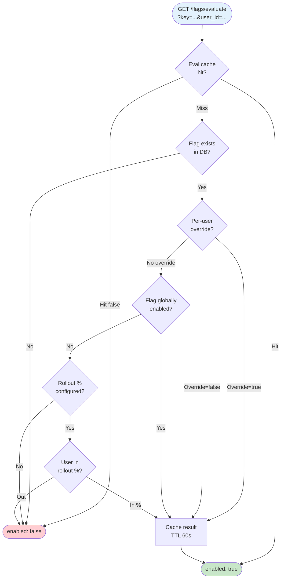
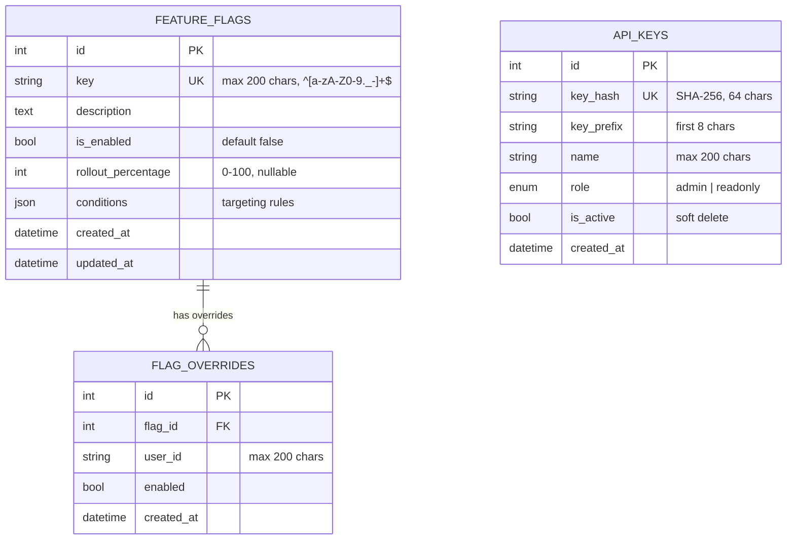

# Architecture Flow Diagram

This document describes the request lifecycle and data flow of the Feature Flag Service.

## Request Lifecycle

```mermaid
flowchart TB
    Client([Client / SDK])

    subgraph Edge["Edge Layer"]
        CORS[CORS Middleware]
        TH[Trusted Host Middleware]
    end

    subgraph Observability["Observability Layer"]
        PROM[Prometheus Middleware<br/>Metrics Collection]
        RL[Rate Limiter<br/>Sliding Window per IP]
        SEC[Security Headers<br/>Middleware]
        LOG[Request Logging<br/>X-Request-ID]
    end

    subgraph Auth["Authentication"]
        APIH{X-API-Key Header}
        MASTER[Master Key Check]
        DBKEY[DB Key Lookup<br/>SHA-256 Hash]
        ROLE{Role Check}
    end

    subgraph App["Application Layer"]
        ROUTER[FastAPI Router]
        EVAL[Evaluation Engine]
        CRUD[Flag CRUD]
        KEYS[API Key Mgmt]
    end

    subgraph Data["Data Layer"]
        CACHE[(Redis Cache<br/>Flag + Eval TTL)]
        DB[(PostgreSQL<br/>Feature Flags<br/>Overrides<br/>API Keys)]
    end

    subgraph Ops["Observability Endpoints"]
        HEALTH[/health]
        METRICS[/metrics]
    end

    Client -->|HTTP Request| CORS
    CORS --> TH
    TH --> PROM
    PROM --> RL
    RL -->|429 if exceeded| Client
    RL --> SEC
    SEC --> LOG
    LOG --> ROUTER

    ROUTER --> APIH
    APIH -->|Missing| Client
    APIH --> MASTER
    MASTER -->|Match| ROLE
    MASTER -->|No Match| DBKEY
    DBKEY -->|Invalid| Client
    DBKEY -->|Valid| ROLE
    ROLE -->|Forbidden| Client
    ROLE -->|Authorized| App

    ROUTER --> EVAL
    ROUTER --> CRUD
    ROUTER --> KEYS

    EVAL -->|1. Check Cache| CACHE
    EVAL -->|2. Load Flag| DB
    EVAL -->|3. User Override?| DB
    EVAL -->|4. Cache Result| CACHE

    CRUD --> DB
    CRUD -->|Invalidate| CACHE
    KEYS --> DB

    ROUTER --> HEALTH
    ROUTER --> METRICS
    HEALTH -->|Ping| DB
    HEALTH -->|Ping| CACHE
    METRICS -->|Scrape| PROM

    style Edge fill:#e3f2fd,stroke:#1565c0
    style Observability fill:#fff3e0,stroke:#e65100
    style Auth fill:#fce4ec,stroke:#c62828
    style App fill:#e8f5e9,stroke:#2e7d32
    style Data fill:#f3e5f5,stroke:#6a1b9a
    style Ops fill:#eceff1,stroke:#455a64
```

## Evaluation Flow (Detail)



## Data Model


